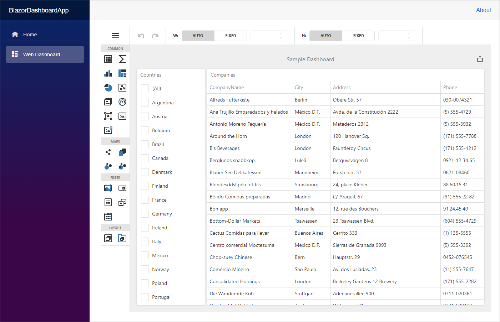

<!-- default badges list -->

<!-- default badges end -->
# Dashboard for Blazor WebAssembly - Get Started

This project demonstrates how you can incorporate a DevExpress Dashboard component into a [Blazor WebAssembly](https://docs.microsoft.com/en-us/aspnet/core/blazor/hosting-models?view=aspnetcore-6.0#blazor-webassembly) application. Use it as a template when you need to create a similar web application.

The Dashboard component wraps the JavaScript [DashboardControl](https://docs.devexpress.com/Dashboard/js-DevExpress.Dashboard.DashboardControl) and uses an ASP.NET Core backend with the Dashboard Controller to handle client data requests.

<!-- default file list -->
## Files to Look At

* [Dashboard.razor](./CS/BlazorDashboardApp/Client/Pages/Dashboard.razor)
* [Program.cs](./CS/BlazorDashboardApp/Server/Program.cs)
<!-- default file list end -->

## Documentation

- [Create a Blazor WebAssembly Dashboard Application](https://docs.devexpress.com/Dashboard/401892)

## More Examples

- [Get Started - Dashboard Component in Blazor Server Application](https://github.com/DevExpress-Examples/dashboard-blazor-server-app)
- [Dashboard Blazor WebAssembly App - Configuration](https://github.com/DevExpress-Examples/dashboard-blazor-webassembly-configuration)
- [Dashboard Blazor WebAssembly App - JavaScript Customization](https://github.com/DevExpress-Examples/dashboard-blazor-webassembly-js-customization)
